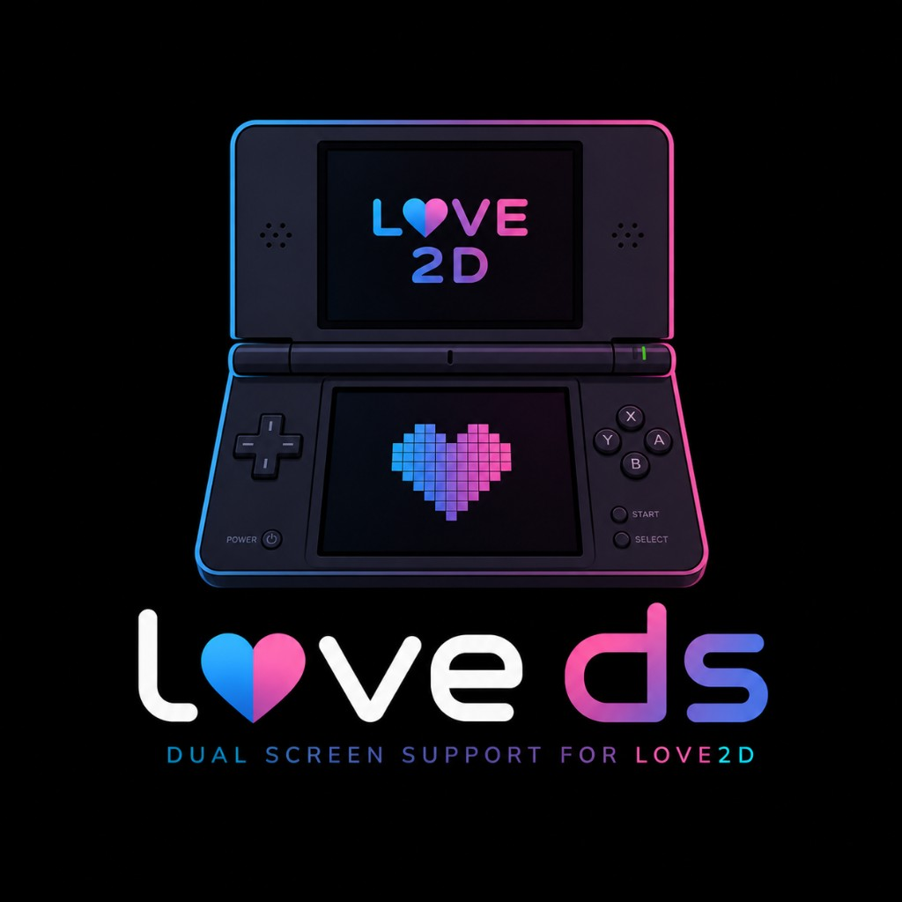

# loveDS — Dual-Screen Game SDK for Android



Build dual-screen games for Android handhelds like the **Ayn Thor** using [LÖVE](https://love2d.org/) (Love2D) and Lua.

loveDS gives you a simple Lua API (`dualscreen.lua`) that renders to two independent displays — the main screen and a secondary touchscreen — backed by a custom Love2D engine fork and an Android wrapper that drives the second display via a dedicated `Presentation` surface.

On desktop or single-screen devices, your game runs in a stacked composite view so you can develop and test without hardware.

## Features

- **`dualscreen.lua`** — drop-in Lua library with `drawToPrimary()` / `drawToSecondary()` callbacks
- **Per-screen rendering config** — target resolution, scale modes (fit / stretch / fill / none)
- **Single-screen modes** — stacked composite or primary-only, works on desktop and single-screen Android
- **Content swapping** — `swapScreens()` to swap what's shown on each display at runtime
- **Touch on both screens** — symmetric touch API with coordinate normalization
- **Full LÖVE API** — use everything you already know (graphics, audio, input, gamepads)
- **Template game included** — clone, build, and run a working example in minutes

## Getting Started

### Prerequisites

- [Android Studio](https://developer.android.com/studio) (recent stable)
- Android NDK (install via Android Studio's SDK Manager)
- A dual-screen Android device (e.g. Ayn Thor) or desktop for stacked preview

### 1. Clone the repo

```bash
git clone --recursive https://github.com/Jtmaca9/loveDS.git
cd loveDS
```

The `--recursive` flag pulls in the engine and Android wrapper automatically.

### 2. Copy the template game into the Android project

```bash
cp -r template/game/* android/app/src/embed/assets/
```

On Windows (PowerShell):

```powershell
Copy-Item -Recurse template\game\* android\app\src\embed\assets\
```

### 3. Build and run

1. Open the `android/` folder in Android Studio
2. Select build variant **`embedNoRecordDebug`**
3. Run on your device

The primary screen shows a movable player dot (D-pad / stick / arrow keys), and the secondary screen shows a map view with touch indicators. Press Tab to swap screens.

## Project Structure

```
loveDS/
├── engine/              # Love2D fork with love.dualscreen C++ module (submodule)
├── android/             # love-android fork with Presentation + JNI bridge (submodule)
├── template/game/       # Starter game you can build on
│   ├── main.lua         # Game entry point
│   ├── conf.lua         # LÖVE configuration
│   └── dualscreen.lua   # Dual-screen Lua library
├── docs/
│   └── GAME_GUIDE.md    # Lua API reference for dualscreen.lua
└── scripts/             # Bootstrap and sync helpers
```

## Writing Your Own Game

Copy `template/game/` as a starting point and edit `main.lua`. The core pattern is:

```lua
local ds = require("dualscreen")

function love.load()
    ds.init({
        primary   = { targetWidth = 960, targetHeight = 540, scaleMode = "fit" },
        secondary = { targetWidth = 540, targetHeight = 620, scaleMode = "fit" },
    })
end

function love.update(dt)
    ds.update()
end

function love.draw()
    ds.drawToPrimary(function(w, h)
        love.graphics.print("Hello from the primary screen!", 10, 10)
    end)

    ds.drawToSecondary(function(w, h)
        love.graphics.print("Hello from the secondary screen!", 10, 10)
    end)

    ds.present()
end

function love.quit()
    ds.deinit()
end
```

See [docs/GAME_GUIDE.md](docs/GAME_GUIDE.md) for the full API reference.

## License

See individual submodule repositories for license terms.
